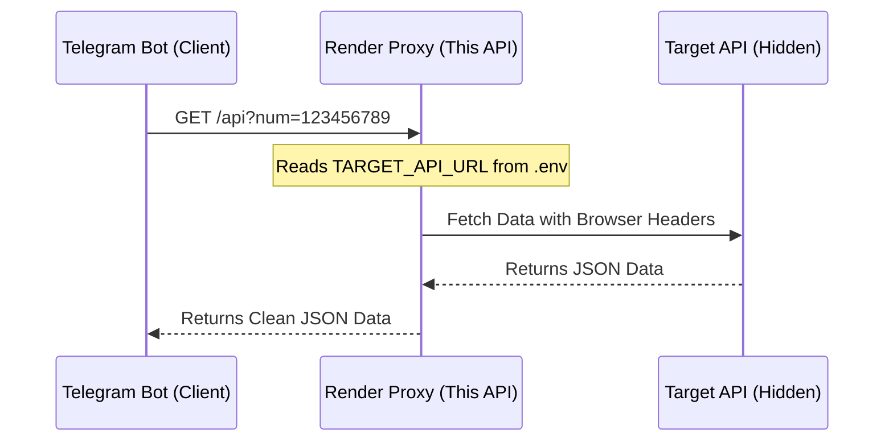

<div align="center">

# 🛡️ Secure Proxy API Service

*A lightweight, high-performance Flask proxy API designed to bypass client-side restrictions and anti-bot mechanisms when fetching data from external sources.*

[](https://www.python.org/)
[](https://flask.palletsprojects.com/)
[](https://render.com/)
[](https://uptimerobot.com/)

</div>

---

## 📖 Overview

When scraping or fetching data from external APIs, many services employ strict anti-bot measures (such as Cloudflare or InfinityFree challenges) that block automated scripts. 

This **Secure Proxy API** sits between your application and the target API. It safely forwards your requests, handles HTML challenge pages, and returns clean JSON data. It also features a health-check endpoint specifically designed to keep Render's free tier awake 24/7.

### 🔄 Architecture Flow



---

## ✨ Features

- 🔒 **Environment Variable Security:** Target API endpoints and secret keys are hidden in `.env` files, keeping your public repository safe.
- 🌐 **Anti-Bot Bypass:** Uses real browser User-Agents and detects HTML challenge pages to gracefully handle blocks.
- 🔌 **Health Check Endpoint:** Provides a `/health` endpoint that accepts `HEAD` and `GET` requests, perfect for uptime monitors.
- 🚀 **Render Ready:** Includes a `render.yaml` for one-click deployment.
- 🐳 **Minimal Dependencies:** Built with only Flask and HTTPX.

---

## 📁 Project Structure

```text
.
├── .env                  # Local secrets (NEVER commit this)
├── .env.example          # Template for environment variables
├── .gitignore            # Ensures .env and cache are ignored
├── app.py                # Main Flask application
├── README.md             # Project documentation
├── render.yaml           # Render deployment configuration
└── requirements.txt      # Python dependencies
```

---

## ⚙️ Environment Variables

To keep your secrets safe, this project uses environment variables. 

1. Copy the example file:
   ```bash
   cp .env.example .env
   ```

2. Open `.env` and fill in your target API base URL:
   ```env
   # The base URL of the API you want to proxy
   TARGET_API_URL=https://example.com/api?key=your_secret_key&num=
   ```

> **⚠️ SECURITY WARNING:** Never commit your `.env` file to a public repository. The included `.gitignore` will prevent this automatically, but always double-check before pushing to GitHub.

---

## 🚀 Deployment Guide (Render)

Deploying this proxy to Render is free and takes less than 5 minutes.

1. **Push to GitHub:** Upload all files (except `.env`) to a new GitHub repository.
2. **Create Web Service on Render:**
   - Go to [Render.com](https://render.com) and log in.
   - Click **New +** -> **Web Service**.
   - Connect your GitHub repository.
3. **Configure Build Settings:**
   - Render will automatically detect `render.yaml` and fill in the build/start commands. 
   - Ensure the **Start Command** is set to: `gunicorn app:app`
4. **Add Secret Environment Variables:**
   - Scroll down to the **Environment Variables** section on the Render setup page.
   - Click **Add Environment Variable**.
   - **Key:** `TARGET_API_URL`
   - **Value:** `https://example.com/api?key=your_secret_key&num=` *(Replace with your actual target API)*.
5. **Deploy:** Click **Create Web Service**. Wait for the build to finish and copy your new Render URL (e.g., `https://my-proxy-api.onrender.com`).

---

## ⏰ Keeping it Awake (UptimeRobot)

Render's free tier will spin down your service after 15 minutes of inactivity. To keep it running 24/7:

1. Create a free account at [UptimeRobot.com](https://uptimerobot.com).
2. Click **+ Add New Monitor**.
3. **Monitor Type:** `HTTP(s)`
4. **Friendly Name:** `Proxy API Health`
5. **URL:** `https://my-proxy-api.onrender.com/health` *(Replace with your Render URL)*.
6. **Monitoring Interval:** `Every 5 minutes`.
7. Click **Create Monitor**.

UptimeRobot will now ping your `/health` endpoint every 5 minutes, preventing Render from putting your service to sleep.

---

## 📡 API Reference

### 1. Proxy Endpoint
Fetches data from the hidden target API.

**Request:**
```http
GET /api?num=<NUMBER>
```

**Example Request:**
```http
GET https://my-proxy-api.onrender.com/api?num=123456789
```

**Success Response (200 OK):**
```json
{
  "status": "success",
  "data": {
    "user_id": "123456789",
    "country": "Example",
    "number": "+1 23456789"
  }
}
```

**Error Response (503 Service Unavailable):**
```json
{
  "error": "Blocked by target anti-bot (HTML challenge)"
}
```

### 2. Health Check Endpoint
Used for uptime monitoring. Returns an empty 200 OK response.

**Request:**
```http
HEAD /health
```

**Response:**
```http
HTTP/1.1 200 OK
```

---

<div align="center">

**Built with ❤️ by Tuku for secure and reliable data fetching.**

</div>
